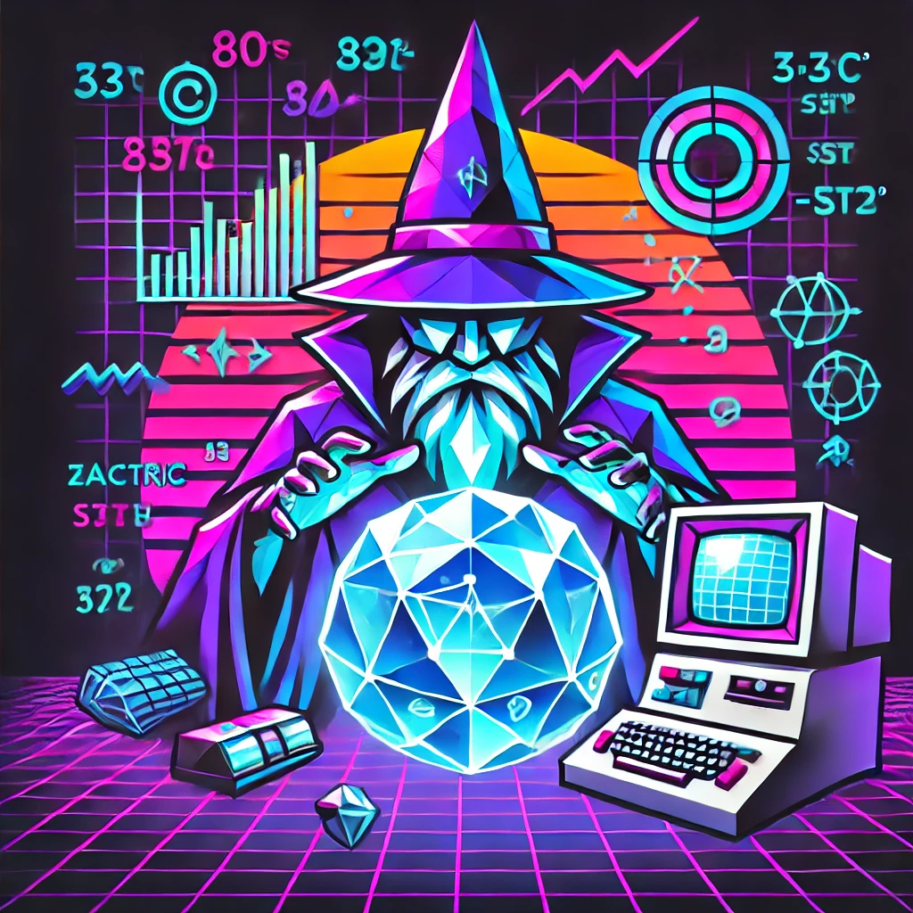

# Forecasting
Making predictions

## About
I am interested in the field of forecasting.  Forecasting brings together my interests in programming, statistics, history, economics, demography, politics, and everything else.  This repo is a collection of notebooks and infrastructure to help me make better predictions.  I am primarly active on the play-money prediction market platform  [manifold.markets](https://manifold.markets/ZachFlanders)
